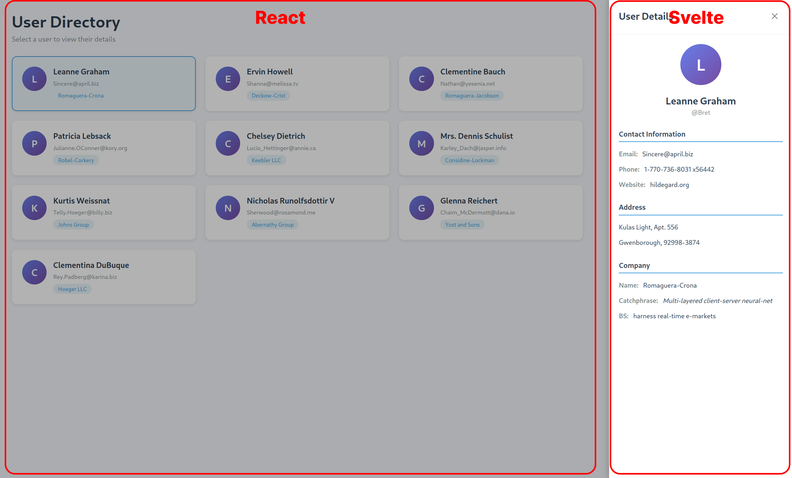

## Query Model
### Microfrontend usage
In this example, we will use the [Query Model](documentation/docs/query-model) to fetch data from a microfrontend as a shared model between two microfrontends which one of them is a react and another one is a svelte application.
In this case two teams in different framework can use same automated data logics without duplicating the code.

[Github Repository](https://github.com/Reactive-Query-Lab/microfront-reactive-query-example)
